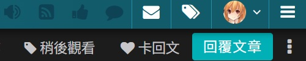
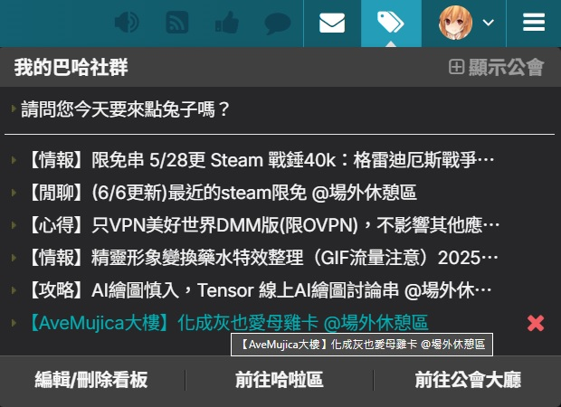
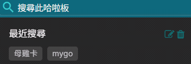

# 巴哈姆特

* [稍後觀看](#稍後觀看)
* [哈拉區搜尋紀錄個別刪除](#哈拉區搜尋紀錄個別刪除)
* [哈拉區最近閱覽看板紀錄數量增加](#哈拉區最近閱覽看板紀錄數量增加)
* [哈拉區最近閱覽看板紀錄規則修改](#哈拉區最近閱覽看板紀錄規則修改)
* [首頁全畫面廣告自動關閉](#首頁全畫面廣告自動關閉)
* [隱藏自動簽到視窗](#隱藏自動簽到視窗)

## 稍後觀看

#### 安裝

[ForumWatchLater.user.js](https://github.com/Sayuki2123/user-scripts/raw/main/Bahamut/ForumWatchLater.user.js)

#### 功能

* 可以對整串文章 (C頁) 或是單一樓層 (Co頁) 加入稍後觀看
  > 對「看他的文」加入稍後觀看時，會視同整串文章，而非只有該作者的文章
* 記錄最後抵達的樓層

> [!TIP]
>
> * 加入稍後觀看的按鈕會顯示在「卡回文」左邊
> * 稍後觀看列表會顯示在右上角的「我的看板及公會」裡面
> * 稍後觀看列表可以拖曳排序
> * 從稍後觀看刪除時，按住 Shift 可以跳過確認視窗直接刪除

#### 預覽

* 加入稍後觀看按鈕 
  
* 稍後觀看列表 
  

#### 更新日誌

* v1.1.0
  * 記錄最後抵達的樓層
  * 稍後觀看列表可以拖曳排序
  * 從稍後觀看刪除時，按住 Shift 可以跳過確認視窗直接刪除
* v1.0.0
  * 調整加入稍後觀看按鈕的位置
  * 調整整體的樣式
* v0.2.0
  * 調整顯示稍後觀看列表的時機
  * 調整加入稍後觀看按鈕的位置
  * 調整紀錄資料的格式
  * 支援 Co 頁
* v0.1.0
  * 測試版

## 哈拉區搜尋紀錄個別刪除

#### 安裝

[ForumSearchHistoryRemover.user.js](https://github.com/Sayuki2123/user-scripts/raw/main/Bahamut/ForumSearchHistoryRemover.user.js)

#### 功能

* 哈拉區的搜尋紀錄可以個別刪除

#### 預覽

#### 更新日誌

* v1.1.0
  * 因巴哈姆特加入刪除功能，調整刪除按鈕的樣式
  * 修改刪除紀錄的方式，不再顯示彈出視窗
* v1.0.0
  * 初版

## 哈拉區最近閱覽看板紀錄數量增加

#### 安裝

[ForumLastBoardMaxNumber.user.js](https://github.com/Sayuki2123/user-scripts/raw/main/Bahamut/ForumLastBoardMaxNumber.user.js)

#### 功能

* 最近閱覽看板的最大數量增加到 20 個

> [!NOTE]
>
> 此腳本只有修改最大數量限制，沒有另外儲存最近閱覽看板的紀錄，如果巴哈姆特有相關功能的更新可能會導致超過預設數量的看板紀錄遺失。

#### 更新日誌

* v1.0.0
  * 初版

## 哈拉區最近閱覽看板紀錄規則修改

#### 安裝

[ForumLastBoardRecordRule.user.js](https://github.com/Sayuki2123/user-scripts/raw/main/Bahamut/ForumLastBoardRecordRule.user.js)

#### 功能

* 進到文章頁面 (C、Co) 時，如果該頁面所屬的看板沒有在最近閱覽看板內的話，就不會記錄到最近閱覽看板

> [!NOTE]
>
> 進入到哈拉區看板的任何頁面都會更新最近閱覽看板，所以在進入文章頁面之前或之後有經過該看板的其他頁面的話此腳本就會無效。

#### 更新日誌

* v1.0.0
  * 初版

## 首頁全畫面廣告自動關閉

#### 安裝

[AutoCloseHomepageAd.user.js](https://github.com/Sayuki2123/user-scripts/raw/main/Bahamut/AutoCloseHomepageAd.user.js)

#### 功能

* 進入首頁時遇到全畫面廣告會自動關閉

#### 更新日誌

* v1.0.0
  * 初版

## 隱藏自動簽到視窗

#### 安裝

[HideAutoSigninWindow.user.js](https://github.com/Sayuki2123/user-scripts/raw/main/Bahamut/HideAutoSigninWindow.user.js)

#### 功能

* 隱藏自動簽到的彈出視窗

#### 更新日誌

* v1.0.0
  * 初版
