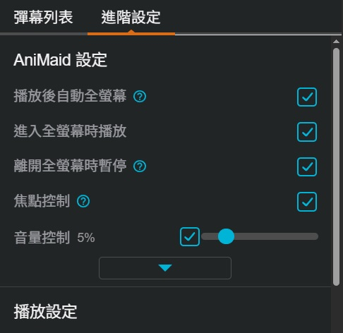

# 巴哈姆特動畫瘋

* [AniMaid](#animaid)
* [截圖工具](#截圖工具)
* [下一集不自動播放](#下一集不自動播放)
* [Facebook 粉絲專頁內嵌](#facebook-粉絲專頁內嵌)

## AniMaid

#### 安裝

[AniMaid.user.js](https://github.com/Sayuki2123/user-scripts/raw/main/BahamutAnime/AniMaid.user.js)

#### 功能

* 快捷鍵
  | 按鍵 | 功能 | 
  | :--: | ---- |
  | `Ctrl  + ⮂` | 快進或後退 30 秒 |
  | `Shift + ⮂` | 快進或後退 1 秒 |
  | `Alt   + ⮂` | 快進或後退 $\frac{1}{24}$ 秒 |
  | `Page Up`    | 後退 90 秒 |
  | `Page Down`  | 快進 88 秒 |
  | `C`          | 暫停時按下可以隱藏或顯示控制列 |
  | `D`          | 彈幕開關時會有提示，並在彈幕開啟時同時更新彈幕 |
  | `R`          | 解除畫面翻轉 |
  | `Ctrl  + R`  | 畫面垂直翻轉 |
  | `Shift + R`  | 畫面水平翻轉 |
  | `S`          | 恢復預設速度 |
  | `Ctrl  + S`  | 加快影片速度 |
  | `Shift + S`  | 減慢影片速度 |
  | `Z`          | 記住現在的播放時間 |
  | `X`          | 回到上次記住的時間 |
  | `[`          | 設定或解除區間重複播放的起點 |
  | `]`          | 設定或解除區間重複播放的終點 |
  | `\`          | 清除已經設定的起點和終點並結束區間重複播放 |
 
* 其他功能
  * 劇院模式時自動隱藏上方選單
  * 進入頁面時自動切換到設定頁面以隱藏彈幕列表
  * 焦點控制：在不能打字的地方按下 F、T 或 Tab 都可以使影片播放器取得焦點
  * 音量控制：可以修改每次調整音量的變動值
  * 播放後自動進入全螢幕
  * 進入全螢幕時自動播放
  * 離開全螢幕時自動暫停，但僅限使用 Esc 離開全螢幕時

#### 已知問題

* 變更播放速度時，彈幕速度最快不會超過 2 倍
* 播放後進入全螢幕，在廣告「自動」結束前，焦點有離開過播放器或網頁就會失敗

#### 預覽

#### 更新日誌

* v1.4.0
  * 新增快捷鍵
    * 隱藏控制列
    * 區間重複播放
  * 新增其他功能
    * 音量控制
    * 播放後自動進入全螢幕
    * 進入全螢幕時自動播放
    * 離開全螢幕時自動暫停
    * 選項設定介面
* v1.3.0
  * 新增快捷鍵
    * 速度控制
    * 畫面翻轉
    * 焦點控制
  * 修正結束動漫通後按下快捷鍵沒有反應的問題
* v1.2.1
  * 因動畫瘋新增彈幕快捷鍵，修改既有彈幕快捷鍵和控制方式
* v1.2.0
  * 新增使用修飾鍵 + 左右方向鍵額外控制進度條
* v1.1.0
  * 新增彈幕開關快捷鍵
    * 使用快捷鍵開關彈幕時會有畫面提示
    * 使用快捷鍵打開彈幕時會同時更新彈幕列表
  * 進入頁面時自動隱藏彈幕列表
* v1.0.0
  * 初版
    * 可以使用按鍵快速跳過 OP 和 ED
    * 記住播放時間和跳回記住的時間
    * 劇院模式時自動隱藏上方選單

## 截圖工具

#### 安裝

[AniMaidGallery.user.js](https://github.com/Sayuki2123/user-scripts/raw/main/BahamutAnime/AniMaidGallery.user.js)

#### 功能

* 播放器快捷鍵

  | 按鍵 | 功能 |
  | :--: | ---- |
  | `PrtSc`  | 保存截圖 |
  | `Insert` | 切換快速合併模式 |

* 快速合併模式
  * 按下 `Insert` 開啟
  * 開啟時播放器內會顯示可以調整合併時裁切範圍的拉桿
  * 按下 `PrtSc` 截圖
  * 按下 `Insert` 結束
  * 結束時會依照快速合併模式期間內的截圖順序自動合併

* 截圖列表
  * 時間跳轉：按下截圖的時間文字可以讓影片跳轉到該截圖的時間點
  * 預覽截圖
  * 複製截圖
  * 下載截圖
  * 刪除截圖
  * 選擇截圖
    * 按住 `Shift` 可以一次選擇多個截圖，選擇下列依序第一個符合的項目與被點選的截圖之間的全部截圖
      * 往前最接近的已選擇截圖
      * 往後最接近的已選擇截圖
      * 第一個截圖
    * 選擇後可以設定成合併時的主畫面
    * 選擇後出現的數字是合併時的順序
  * 合併截圖
    * 合併所有被選擇且有顯示數字的截圖
    * 依數字順序由小到大進行合併
    * 主畫面預設使用數字 ① 的截圖
    * 主畫面為上拉桿以上的部分
    * 裁切範圍以預覽模式時顯示的拉桿為準
    * 合併後的結果不能與其他截圖再次合併 (選擇後不會出現數字)

* 預覽模式
  * 點擊圖片可以顯示或隱藏拉桿
  * 調整拉桿控制合併時的裁切範圍
    * 拉桿的初始位置為截圖時，播放器內的拉桿位置 (可以使用快速合併模式確認)
    * 按住 `ctrl` 可以同時調整 `所有截圖和播放器` 的拉桿位置
    * 按住 `shift` 可以同時調整 `所有已選擇的截圖` 的拉桿位置
  * 鍵盤快捷鍵

    | 按鍵 | 功能 |
    | :--: | ---- |
    | `⮂`  | 切換預覽 |
    | `⮃`  | 調整拉桿，需要先使用滑鼠選擇拉桿 |
    | `Esc` | 結束預覽 (全螢幕模式時無效) |
    | `Del` | 刪除截圖 |

* 全螢幕模式
  * 僅限播放器為全螢幕模式時才可以使用，按下 `G` 開啟或關閉
  * 開啟時會自動暫停影片
  * 關閉時如果播放器還是全螢幕模式的話，會自動繼續播放
    > 全螢幕模式下的 `Esc` 會受到瀏覽器的控制，在全螢幕模式時進入預覽模式後使用 `Esc` 會連同播放器一起離開全螢幕模式

* 其他
  * 在播放器的控制列增加截圖按鈕

> [!TIP]
>
> * `PrtSc` 只有在放開按鍵時才能被偵測到，所以截圖時間與實際時間會有誤差是正常的
> * 可以暫停後再截圖，不會擷取到影片以外的部分
> * 動畫瘋的彈幕渲染方式不能直接對彈幕截圖，所以截圖內不會有彈幕
> * 因為使用的按鍵是 `PrtSc`，作業系統本身也會對整個畫面做截圖並複製到剪貼簿，與此截圖工具沒有衝突
> * 拉桿的設計主要是擷取字幕用，但是不同動畫的字幕大小和位置不一定相同，所以拉桿的預設位置僅供參考

#### 預覽

* 截圖列表
  

* 預覽模式
  

* 全螢幕模式
  

* 合併字幕
  

* 合併截圖
  

#### 更新日誌

* v1.0.0
  * 新增全螢幕模式
  * 新增截圖按紐
* v0.3.0
  * 可以一次選擇多個截圖
  * 可以一次調整多個截圖的拉桿位置
  * 可以指定合併時的主要畫面
  * 可以自訂合併截圖的順序
  * 控制裁切範圍的拉桿改成 2 個
  * 調整拉桿的可移動範圍
* v0.2.0
  * 新增預覽模式
    * 預覽時可以調整該截圖的拉桿位置
  * 調整整體樣式
* v0.1.0
  * 測試版
    * 截圖管理，可以複製、下載、刪除和控制影片跳轉到截圖的時間
    * 合併截圖，可以合併各截圖的字幕部分
    * 按下 `PrtSc` 時自動保存截圖
    * 按下 `Insert` 切換快速合併模式

## 下一集不自動播放

#### 安裝

[NoAutoPlay.user.js](https://github.com/Sayuki2123/user-scripts/raw/main/BahamutAnime/NoAutoPlay.user.js)

#### 功能

* 動畫瘋的設定「自動播放下一集」沒有勾選時，觀看完畢後點選「下一集」按鈕後不會自動開始播放
* ~~點選集數列表時，會重新導向整個網頁，而不是只有替換影片~~

#### 更新日誌

* v1.1.0
  * 因動畫瘋的替換影片已經可以連同彈幕和留言區一起更新，刪除集數列表的重新導向功能
* v1.0.0
  * 初版

## Facebook 粉絲專頁內嵌

#### 安裝

[FacebookWidget.user.js](https://github.com/Sayuki2123/user-scripts/raw/main/BahamutAnime/FacebookWidget.user.js)

#### 功能

* 在動畫瘋上方選單增加粉絲專頁的按鈕

#### 預覽

#### 更新日誌

* v1.0.1
  * 因動畫瘋調整選單項目，調整按鈕的出現位置
* v1.0.0
  * 初版
