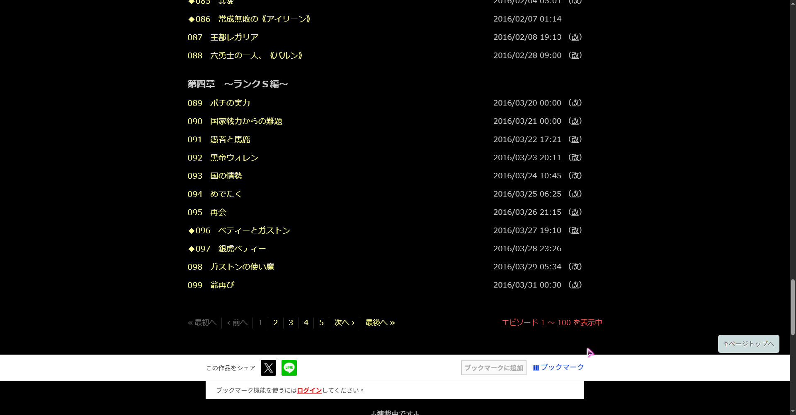
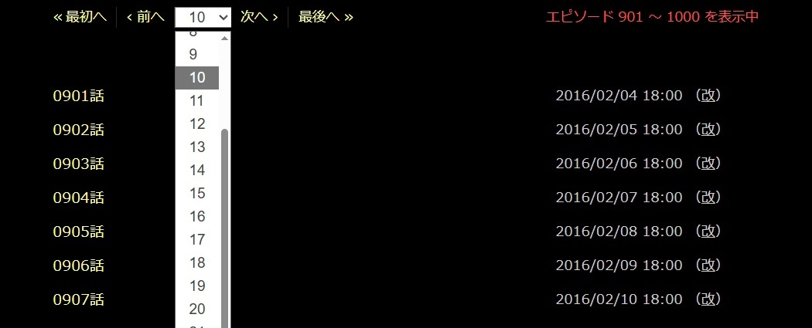

# 小説家になろう

* [目錄頁面顯示全部章節](#目錄頁面顯示全部章節)

## 目錄頁面顯示全部章節

#### 安裝

[ShowAllEpisodes.user.js](https://github.com/Sayuki2123/user-scripts/raw/main/Narou/ShowAllEpisodes.user.js)

#### 功能

* 顯示全部章節
  > 「エピソード ... を表示中」的文字會以紅色標示，按下後會像以前的目錄一樣列出全部章節
* 顯示全部的目錄頁次連結
  > 頁數在 10 頁以下的話，會全部列出 
  > 頁數在 11 頁以上的話，會顯示下拉式選單

#### 預覽

* 顯示全部章節

  

* 目錄連結
  * 10 頁以下 
    
  * 11 頁以上 
    

#### 更新日誌

* v1.0.0
  * 初版
